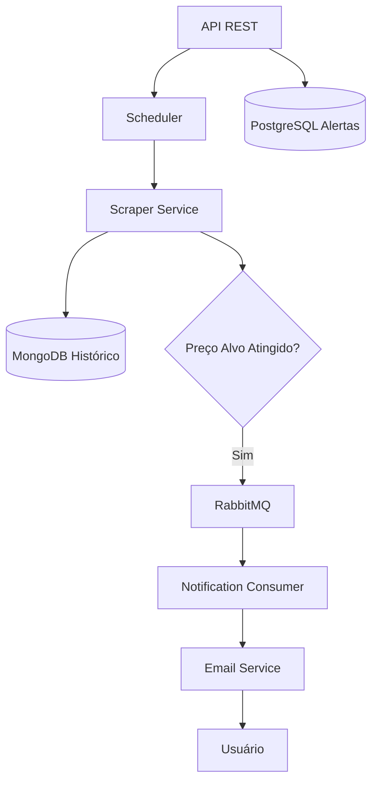

<div align="center">

# 📉 PriceWatch

### Plataforma de Monitoramento Automático de Preços construída com Java + Spring Boot

Monitore preços automaticamente utilizando **Web Scraping**, **RabbitMQ**, **PostgreSQL**, **MongoDB** e **Notificações por E-mail**.

---


---

### ⚡ Monitore preços. Armazene histórico. Notifique automaticamente.

</div>

---

# 📖 Visão Geral

O **PriceWatch** é uma plataforma backend desenvolvida com **Java + Spring Boot** para **monitoramento automatizado de preços em páginas reais de e-commerce**.

O sistema verifica periodicamente os preços utilizando **Web Scraping**, armazena o histórico através de **persistência híbrida (PostgreSQL + MongoDB)** e envia **notificações assíncronas via RabbitMQ** quando o preço configurado pelo usuário é atingido.

Este projeto foi desenvolvido com foco em explorar:

- Fluxos orientados a eventos
- Processamento em segundo plano
- Automação com scraping
- Persistência híbrida
- Comunicação assíncrona
- Arquitetura backend com Spring Boot

---

# ✨ Funcionalidades

## Recursos Principais

✅ Cadastro de alertas de preço

✅ Monitoramento automático

✅ Scraping em e-commerces reais

✅ Histórico de preços

✅ Persistência híbrida

✅ Notificações assíncronas com RabbitMQ

✅ Envio de e-mails

✅ Deploy containerizado com Docker

---

# 🏗️ Arquitetura

O PriceWatch segue uma **arquitetura modular orientada a serviços**, onde cada camada possui responsabilidade específica dentro do fluxo da aplicação.

## Fluxo do Sistema



---

## Camadas da Arquitetura

| Camada | Responsabilidade |
|---|---|
| Controllers | Endpoints REST |
| Services | Regras de negócio |
| Repositories | Persistência |
| Scheduler | Monitoramento periódico |
| Scraper | Captura e normalização de preços |
| Consumer | Processamento assíncrono |
| Email Service | Envio de notificações |

---

# ⚙️ Stack Tecnológica

<div align="center">

| Categoria | Tecnologia |
|---|---|
| Linguagem | Java 17 |
| Framework | Spring Boot |
| Banco SQL | PostgreSQL |
| Banco NoSQL | MongoDB |
| Web Scraping | Jsoup |
| Mensageria | RabbitMQ |
| E-mail | Spring Mail |
| Build Tool | Maven |
| Containerização | Docker |

</div>

---

# 🔄 Fluxo de Funcionamento

O PriceWatch opera através de um pipeline automatizado de monitoramento.

### 1. Cadastro do Alerta

O usuário informa:

- URL do produto
- Preço desejado
- Endereço de e-mail

---

### 2. Monitoramento Agendado

O scheduler consulta periodicamente todos os alertas cadastrados.

---

### 3. Captura de Preço

O `ScraperService` utiliza **Jsoup** e múltiplos seletores CSS para localizar e interpretar o preço do produto.

---

### 4. Persistência do Histórico

Alterações de preço são registradas no **MongoDB** para manter o histórico de variação.

---

### 5. Notificação Assíncrona

Quando o preço configurado é atingido:

- Evento publicado no RabbitMQ
- Notificação processada assincronamente

---

### 6. Entrega do E-mail

O consumer recebe a mensagem e realiza o envio do e-mail ao usuário.

---

# 🚀 Começando

## Pré-requisitos

- Java 17
- Maven
- PostgreSQL
- MongoDB
- RabbitMQ
- Docker (opcional)

---

## Clonar Repositório

```bash
git clone https://github.com/loac02/priceWatch.git
cd priceWatch
```

---

## Build do Projeto

```bash
mvn clean package
```

---

## Executar Aplicação

```bash
java -jar target/*.jar
```

---

# 🐳 Docker

A aplicação possui **Dockerfile multi-stage**, permitindo build e execução através de containers leves.

## Build da Imagem

```bash
docker build -t pricewatch .
```

## Executar Container

```bash
docker run -p 8080:8080 pricewatch
```

---

# 🔐 Variáveis de Ambiente

Configure as seguintes variáveis antes da execução:

| Variável | Descrição |
|---|---|
| DB_URL | URL PostgreSQL |
| DB_USERNAME | Usuário do banco |
| DB_PASSWORD | Senha do banco |
| MONGO_URI | Conexão MongoDB |
| RABBITMQ_HOST | Host RabbitMQ |
| RABBITMQ_PORT | Porta RabbitMQ |
| RABBITMQ_USERNAME | Usuário RabbitMQ |
| RABBITMQ_PASSWORD | Senha RabbitMQ |
| RABBITMQ_SSL | SSL RabbitMQ |
| SPRING_RABBITMQ_VIRTUAL_HOST | Usuário RabbitMQ |
| EMAIL_USER | email user |
| EMAIL_PASS | App Password |
| EMAIL_REMETENTE | Email de envio |
| JAVA_TOOL_OPTIONS | IPV4 |


---

# 📡 Exemplo da API

## Criar Alerta

### Request

**POST** `/alerts`

```json
{
  "emailUsuario": "test@gmail.com",
  "urlProduto": "https://www.test.com.br/produto/",
  "precoAlvo": 5000.00
}
```

---

### Response

```json
{
    "dataCriacao": "2026-05-26T10:30:49.851642759",
    "emailUsuario": "test@gmail.com",
    "id": 10,
    "notificado": false,
    "precoAlvo": 5000.00,
    "urlProduto": "https://www.test.com.br/produto/"
}
```

---

# 📂 Estrutura do Projeto

```bash
src
├── controller
├── service
├── repository
├── scheduler
├── consumer
├── entity
├── config
└── facade
```

---

# 📈 Próximas Evoluções

O roadmap do projeto inclui:

- Camada DTO
- Tratamento global de exceções
- Logging estruturado
- Retry / DLQ no RabbitMQ
- Testes automatizados
- Observabilidade e métricas
- Maior resiliência do scheduler

---

# 🎯 Objetivos do Projeto

O PriceWatch foi desenvolvido para explorar e demonstrar conceitos práticos de engenharia backend como:

- Arquitetura com Spring Boot
- Sistemas de mensageria
- Integração SQL + NoSQL
- Automação com scraping
- Processamento em segundo plano
- Deploy containerizado

---

# 🤝 Contribuições

Sugestões, melhorias e contribuições são bem-vindas.

Sinta-se à vontade para abrir issues ou enviar pull requests.

---

# 📜 Licença

Este projeto está licenciado sob a **Licença MIT**.

---

<div align="center">

### Construído para explorar engenharia backend, processamento assíncrono e automação real com Spring Boot.

⭐ Se este projeto foi interessante para você, considere deixar uma estrela.

</div>
