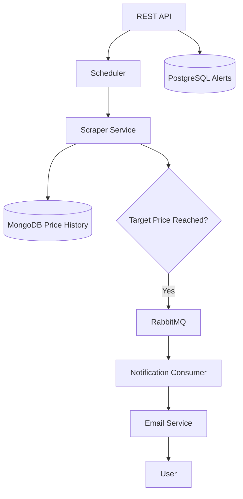

<div align="center">

# 📉 PriceWatch

### Automated Price Monitoring Platform built with Java + Spring Boot

Track product prices automatically using **Web Scraping**, **RabbitMQ**, **PostgreSQL**, **MongoDB**, and **Email Notifications**.

---


---

### ⚡ Monitor prices. Store history. Notify automatically.

</div>

---

# 📖 Overview

**PriceWatch** is a backend platform developed with **Java + Spring Boot** for **automated price monitoring in real e-commerce pages**.

The system periodically checks product prices using **Web Scraping**, stores price history using **hybrid persistence (PostgreSQL + MongoDB)**, and sends **asynchronous email notifications via RabbitMQ** whenever a configured target price is reached.

This project was designed to explore:

- Event-driven workflows
- Background processing
- Scraping automation
- Hybrid persistence
- Asynchronous communication
- Backend architecture with Spring Boot

---

# ✨ Features

## Core Features

✅ Create price alerts

✅ Automatic price monitoring

✅ Real e-commerce scraping

✅ Price history tracking

✅ Hybrid persistence

✅ RabbitMQ async notifications

✅ Email delivery

✅ Dockerized deployment

---

# 🏗️ Architecture

PriceWatch follows a **modular service-oriented architecture** where each layer is responsible for a specific part of the workflow.

## System Flow



---

## Architecture Layers

| Layer | Responsibility |
|---|---|
| Controllers | REST endpoints |
| Services | Business logic |
| Repositories | Data persistence |
| Scheduler | Periodic monitoring |
| Scraper | Price extraction and normalization |
| Consumer | Async notification processing |
| Email Service | Notification delivery |

---

# ⚙️ Tech Stack

<div align="center">

| Category | Technology |
|---|---|
| Language | Java 17 |
| Framework | Spring Boot |
| SQL Database | PostgreSQL |
| NoSQL Database | MongoDB |
| Web Scraping | Jsoup |
| Messaging | RabbitMQ |
| Email | Spring Mail |
| Build Tool | Maven |
| Containerization | Docker |

</div>

---

# 🔄 Workflow

PriceWatch operates through an automated monitoring pipeline.

### 1. Alert Registration
Users register:

- Product URL
- Target price
- Email address

---

### 2. Scheduled Monitoring
The scheduler periodically scans all registered alerts.

---

### 3. Price Extraction
The `ScraperService` fetches and parses product pages using **Jsoup** and multiple CSS selector strategies.

---

### 4. History Persistence
Price changes are stored in **MongoDB** to maintain historical tracking.

---

### 5. Async Notification
When the target price is reached:

- Event published to RabbitMQ
- Notification processed asynchronously

---

### 6. Email Delivery
The consumer receives the message and sends the email notification.

---

# 🚀 Getting Started

## Prerequisites

- Java 17
- Maven
- PostgreSQL
- MongoDB
- RabbitMQ
- Docker (optional)

---

## Clone Repository

```bash
git clone https://github.com/loac02/priceWatch.git
cd priceWatch
```

---

## Build Project

```bash
mvn clean package
```

---

## Run Application

```bash
java -jar target/*.jar
```

---

# 🐳 Docker

The application includes a **multi-stage Dockerfile** for lightweight container deployment.

## Build Image

```bash
docker build -t pricewatch .
```

## Run Container

```bash
docker run -p 8080:8080 pricewatch
```

---

# 🔐 Environment Variables

Configure the following variables before running:

| Variable | Description |
|---|---|
| DB_URL | PostgreSQL URL |
| DB_USERNAME | Database username |
| DB_PASSWORD | Database password |
| MONGO_URI | MongoDB connection |
| RABBITMQ_HOST | RabbitMQ host |
| RABBITMQ_PORT | RabbitMQ port |
| RABBITMQ_USERNAME | RabbitMQ user |
| RABBITMQ_PASSWORD | RabbitMQ password |
| EMAIL_USER | Email account |
| EMAIL_PASS | Email app password |

---

# 📡 API Example

## Create Alert

### Request

**POST** `/alerts`

```json
{
  "emailUsuario": "test@gmail.com",
  "urlProduto": "https://www.test.com.br/produto/",
  "precoAlvo": 5000.00
}
```

---

### Response

```json
{
    "dataCriacao": "2026-05-26T10:30:49.851642759",
    "emailUsuario": "test@gmail.com",
    "id": 10,
    "notificado": false,
    "precoAlvo": 5000.00,
    "urlProduto": "https://www.test.com.br/produto/"
}
```

---

# 📂 Project Structure

```bash
src
├── controller
├── service
├── repository
├── scheduler
├── consumer
├── entity
├── config
└── facade
```

---

# 📈 Future Improvements

The project roadmap includes:

- DTO layer
- Global exception handling
- Structured logging
- Retry / DLQ for RabbitMQ
- Automated testing
- Observability & metrics
- Improved scheduler resilience

---

# 🎯 Project Goals

PriceWatch was developed to explore and demonstrate practical backend engineering concepts such as:

- Spring Boot architecture
- Messaging systems
- SQL + NoSQL integration
- Web scraping automation
- Background processing
- Containerized deployment

---

# 🤝 Contributing

Contributions, suggestions and improvements are welcome.

Feel free to open issues or submit pull requests.

---

# 📜 License

This project is licensed under the **MIT License**.

---

<div align="center">

### Built to explore backend engineering, async processing and real-world automation with Spring Boot.

⭐ If you found this project interesting, consider giving it a star.

</div>
